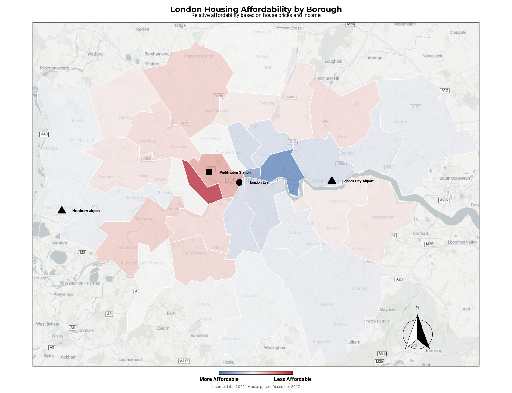
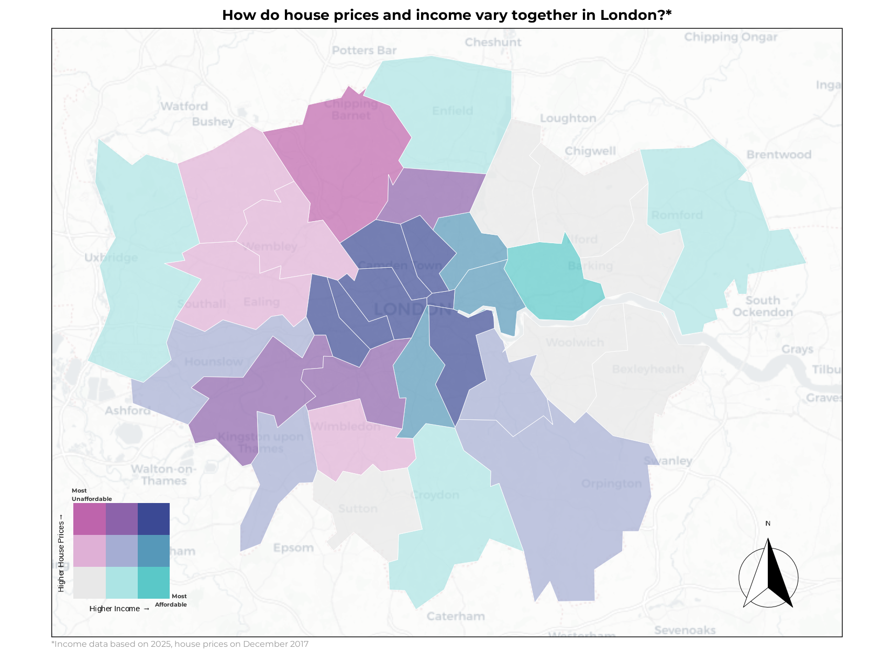

## Geospatial Visualisations

#### Exploring London house prices and and average income by borough

These plots explore the relationship between average house prices and average income across different boroughs in 
London. The visualisations use geospatial data to represent the variations in house prices and income levels 
geographically, and use them to derive insights about affordability and economic disparities in London. I used
two techniques to create these visualisations, one is a bivariate choropleth map plotting both variables at the same
time (the one to the left) and the other is a divergent color scale map plotting affordability.

|  |  |
|:---:|:---:|