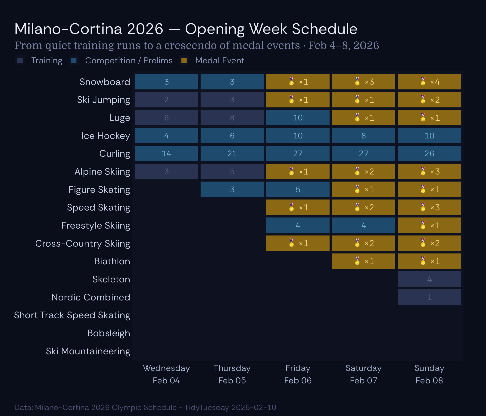
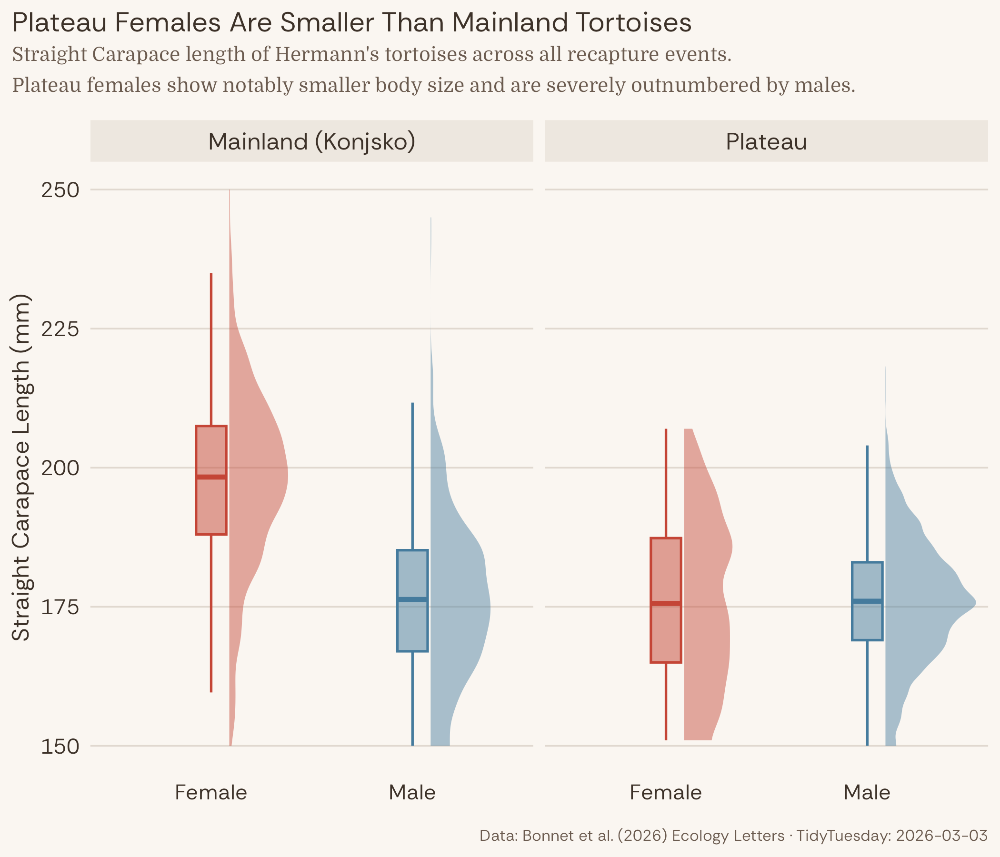
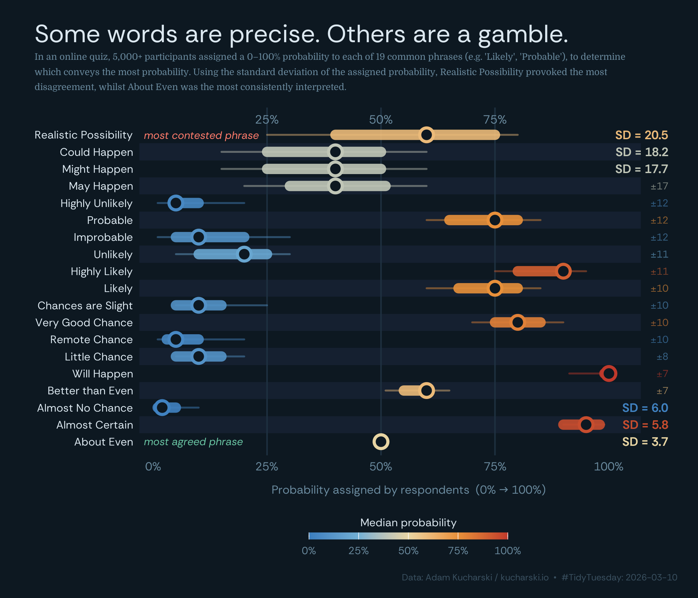
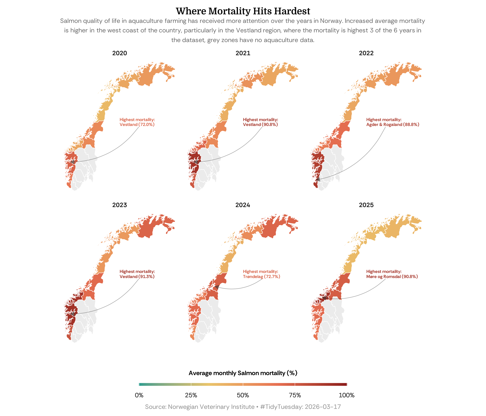
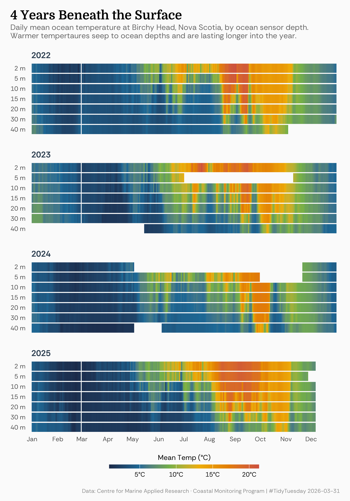

## TidyTuesday

#### Languages in Africa

This visualisation explores the most spoken languages in Africa by number of native speakers. The bar chart highlights Arabic as the dominant language with 150 million native speakers, which is almost 3 times the second most spoken language. The accompanying map shows the geographic distribution of Arabic-speaking countries across the African continent, demonstrating its widespread presence particularly in North and East Africa.

#### Edible Plants

This visualisation explores The Edible Plant Database (EDP), an outcome of the GROW 
Observatory, A European Citizen Science project on growing food, soil moisture sensing and 
land monitoring. It contains information on 146 edible plant species, including their ideal 
growing conditions and time to harvest and germination.

### Winter Olympics 2026

This visualisation explored the Winter Olympics 2026 opening weekend schedule in Milan-Cortina, Italy. The dataset contains 
detailed information about all 1,866 Olympic events, including both competition and training sessions across various winter 
sport disciplines.

#### Tortoise Data

This visualisation examines tortoise populations and characteristics. The plot provides insights 
into the distribution of tortoise species across different regions and the sex. Females are 
outnumbered by males in the Plateau region, leading to increased injury and fall from cliff near 
the plateau.

#### Likely — Probability Phrases

In an online quiz, created as an independent project by Adam Kucharski, over 5,000 participants compared pairs of probability phrases (e.g. "Which conveys a higher probability: Likely or Probable?") and assigned numerical values (0–100%) to each of 19 phrases. This visualisation ranks all 19 phrases by how much respondents disagreed, using the standard deviation of assigned probabilities. *Realistic Possibility* provoked the most disagreement, while *About Even* was the most consistently interpreted.

#### Norwegian Salmon Mortality

This visualisation maps average monthly salmon mortality across Norwegian counties from 2020 to 2025, using data from the Norwegian Veterinary Institute. A faceted choropleth highlights regional differences, with the west coast — particularly Vestland — consistently recording the highest mortality rates. Annotations identify the worst-affected county in each year.

#### Ocean Temperature Anomalies

This visualisation shows ocean temperatures over time from Birchy Head, Nova Scotia. We
plot the data by day over a 4 year period to get a sense of the temperature waters 
throughout the year. The warmer temperatures reach lower depths and remain there for 
longer throughout the year, when compared to previous years.

