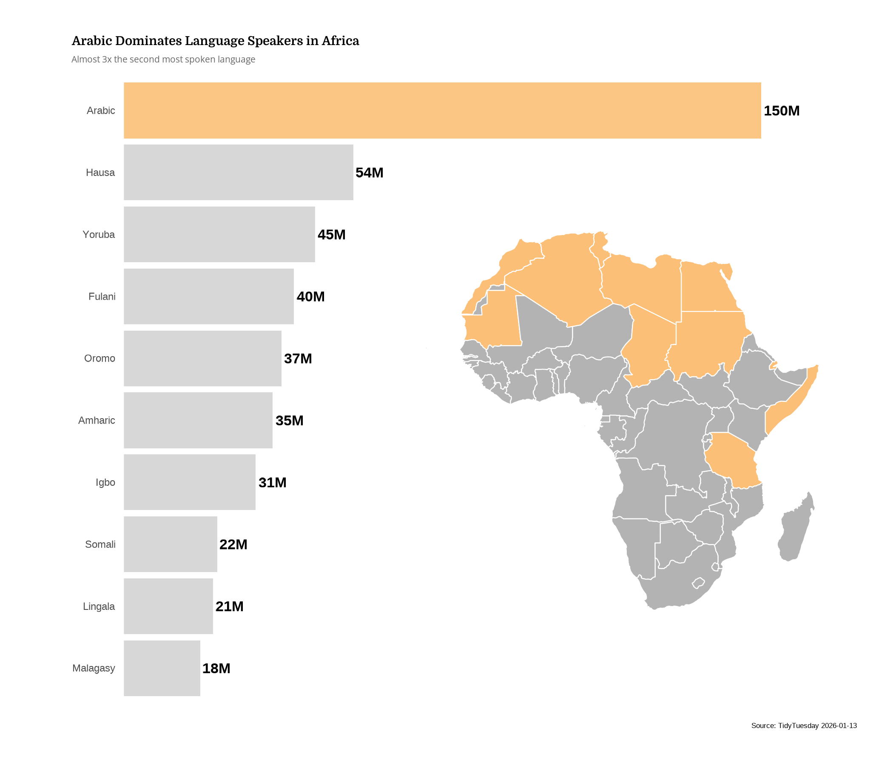
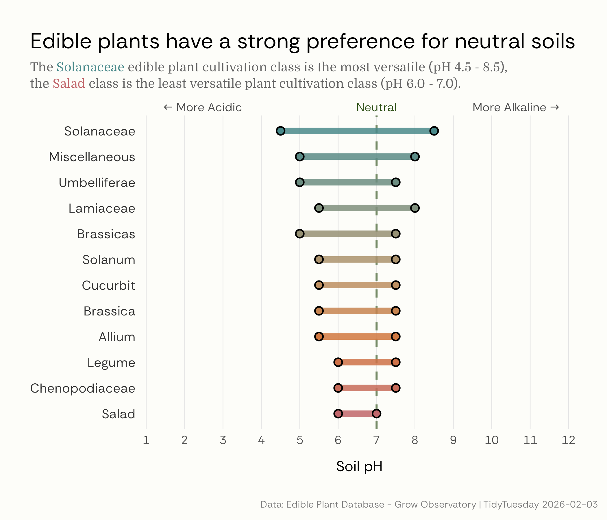

## TidyTuesday

#### Languages in Africa

This visualisation explores the most spoken languages in Africa by number of native speakers. The bar chart highlights Arabic as the dominant language with 150 million native speakers, which is almost 3 times the second most spoken language. The accompanying map shows the geographic distribution of Arabic-speaking countries across the African continent, demonstrating its widespread presence particularly in North and East Africa.

#### Edible Plants

This visualisation explores The Edible Plant Database (EDP), an outcome of the GROW 
Observatory, A European Citizen Science project on growing food, soil moisture sensing and 
land monitoring. It contains information on 146 edible plant species, including their ideal 
growing conditions and time to harvest and germination.

