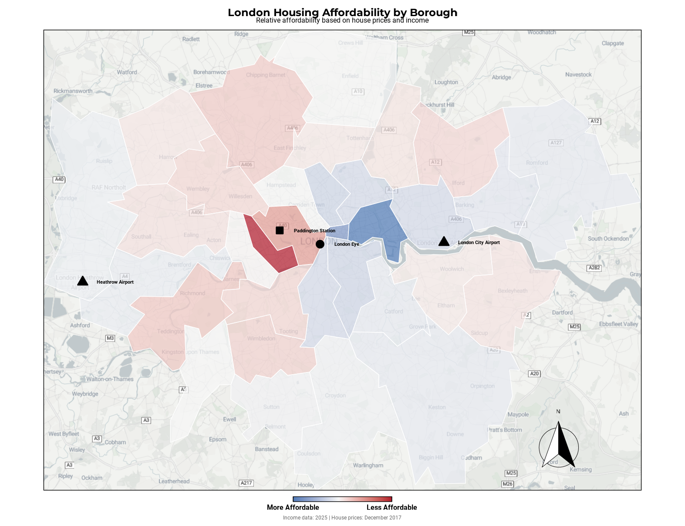
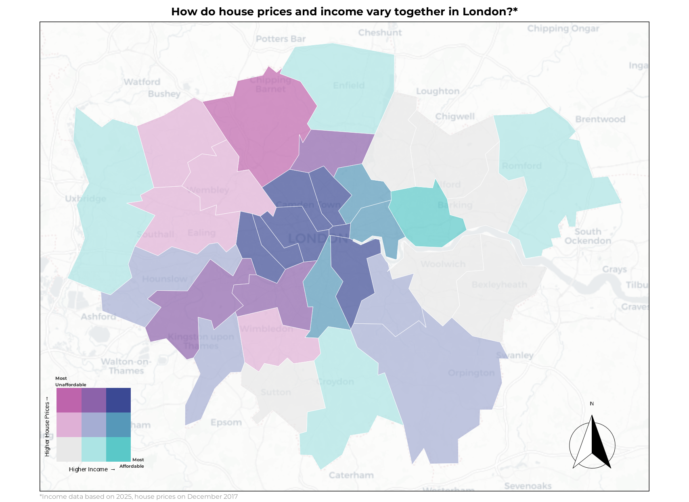
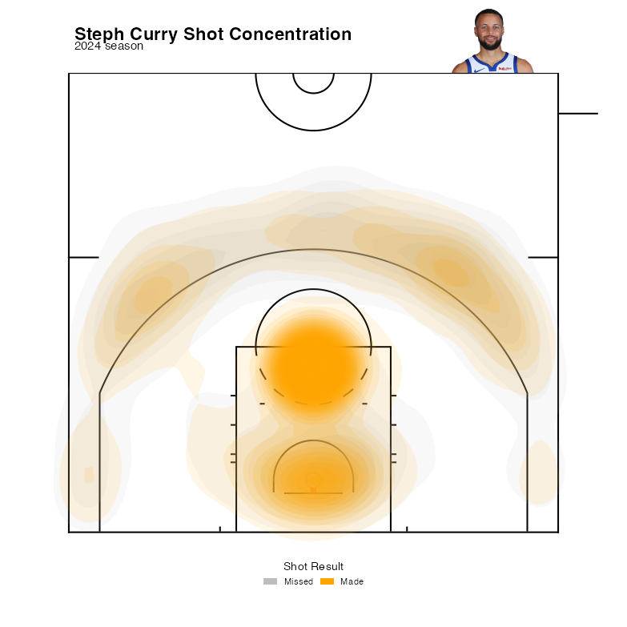

# Data Explorations

This repository contains various data visualization projects. [Some of them are part of the TidyTuesday weekly challenges](https://github.com/rfordatascience/tidytuesday), while others are personal projects exploring different 
datasets. The visualizations cover a range of topics and languages, including R and Python.

## Geospatial Visualisations

####  1. Exploring London house prices and and average income by borough

These plots explore the relationship between average house prices and average income across different boroughs in 
London. The visualizations use geospatial data to represent the variations in house prices and income levels 
geographically, and use them to derive insights about affordability and economic disparities in London. I used
two techniques to create these visualizations, one is a bivariate choropleth map plotting both variables at the same
time (the one to the left) and the other is a divergent color scale map plotting affordability.

|  |  |
|:---:|:---:|

## Sports Visualisations

####  1. Stephen Curry shot chart

This shot chart visualizes the shooting performance of NBA player Stephen Curry during the 2024 season. The chart displays 
the locations of his shots on the basketball court, with different colors indicating whether the shots were made or missed. 
The visualization provides insights into Curry's shooting patterns and effectiveness from various areas on the court.

